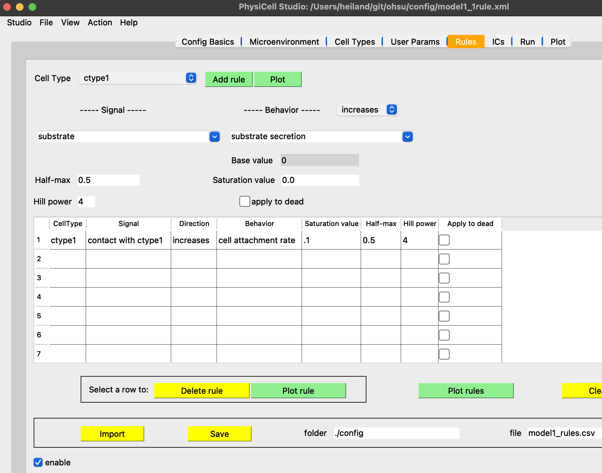

# ohsu

This repository tries to provide some helpful guidance on using PhysiCell + Studio, using a simple, illustrative model, with some sample analysis scripts (coming). If you do not yet have PhysiCell + Studio installed, you can try using this repo (https://github.com/rheiland/studio_template) and following the instructions there.

   
 
Showing two different outcomes, depending on whether a signal/behavior cell rule is used.
I've created a currently unused `ctype2`. We may have `ctype1` cells differentiate into `ctype2` under certain conditions.

 

